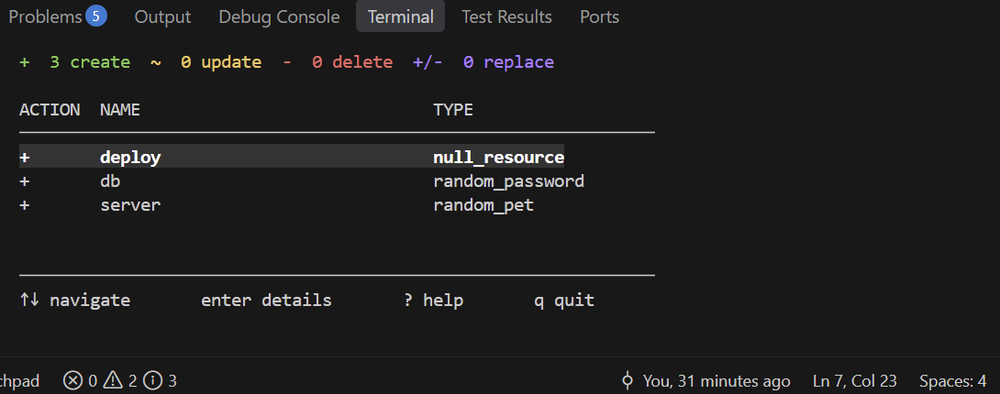
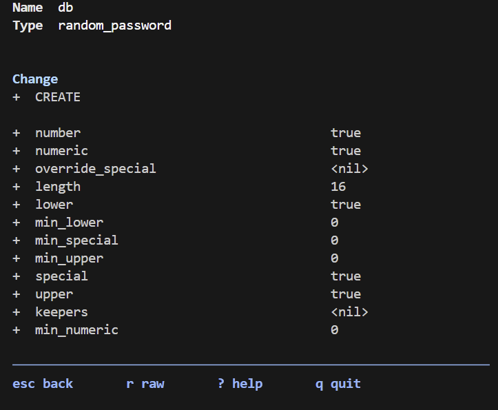
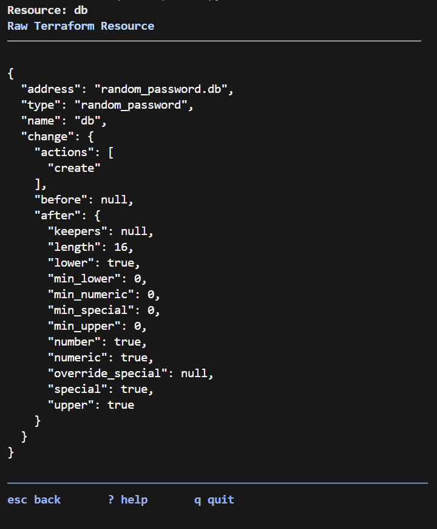

# tfpretty

`tfpretty` is a terminal-based viewer for Terraform plans. It runs your plan and
renders it in a clean, colorized, interactive TUI so changes are easier to read
and understand than raw `terraform plan` output.



## Features

- Interactive plan summary with create / update / delete / replace counts
- Per-resource detail view of changed attributes
- Raw Terraform resource (JSON) view for full inspection
- Built-in help screen
- Color-coded actions and layout that adapts to your terminal width

## Requirements

- [Terraform](https://developer.hashicorp.com/terraform/install) installed and on your `PATH`
- [Go](https://go.dev/dl/) 1.27+ (only needed to install from source)

## Installation

Install the latest release with Go:

```powershell
go install github.com/Akin-Genc0/tfpretty@latest
```

This places a `tfpretty` binary in `$(go env GOPATH)\bin` (usually
`%USERPROFILE%\go\bin`). Add that folder to your `PATH` so `tfpretty` works from
any directory.

### Build from source

```powershell
git clone https://github.com/Akin-Genc0/tfpretty.git
cd tfpretty
go build -o tfpretty.exe .
```

## Usage

Run it from inside any initialized Terraform workspace:

```powershell
tfpretty plan
```

`tfpretty` runs `terraform plan`, reads the JSON output, and opens the viewer.



### Keyboard controls

| Key     | Action                          |
| ------- | ------------------------------- |
| `↑` / `↓` | Move between resources        |
| `enter` | Open the selected resource detail |
| `r`     | View the raw Terraform resource |
| `?`     | Open the help screen            |
| `esc`   | Go back to the plan             |
| `q`     | Quit                            |



## Development

```powershell
go test ./...
```
