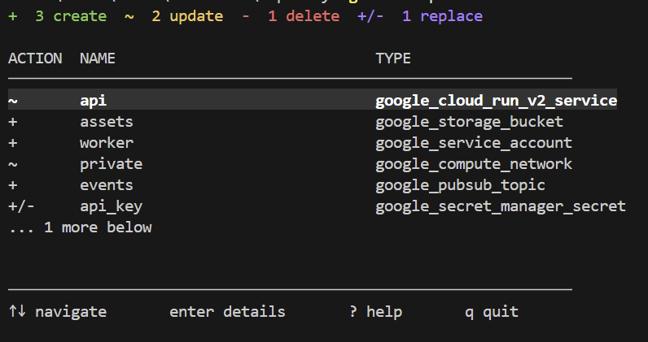

# tfpretty

Ever squinted at a wall of `terraform plan` output trying to figure out what's
actually about to happen to your infrastructure? `tfpretty` fixes that. It runs
your plan for you and drops it into a clean, colorized, interactive terminal UI
so you can actually *see* what's changing instead of scrolling through a wall of text.



## What it does

- Gives you an at-a-glance summary: creates, updates, deletes, and replacements, all counted up front
- Lets you drill into any resource to see exactly which attributes changed
- Shows the raw Terraform resource JSON when you need the full, unfiltered truth


## Before you start

You'll need:

- [Terraform](https://developer.hashicorp.com/terraform/install) installed and on your `PATH`
- [Go](https://go.dev/dl/) 1.27+ only if you're installing from source

## Installing

The quickest way is with `go install`:

```powershell
go install github.com/Akin-Genc0/tfpretty@latest
```

This drops a `tfpretty` binary into `$(go env GOPATH)\bin` (usually
`%USERPROFILE%\go\bin`). Make sure that folder is on your `PATH` so you can run
`tfpretty` from anywhere.

### Building from source

Prefer to build it yourself? Here you go:

```powershell
git clone https://github.com/Akin-Genc0/tfpretty.git
cd tfpretty
go build -o tfpretty.exe .
```

## Using it

Jump into any initialized Terraform workspace and run:

```powershell
tfpretty plan
```

That's it. `tfpretty` runs `terraform plan` behind the scenes, parses the JSON
output, and hands you the interactive viewer.


### Keyboard controls

| Key       | What it does                       |
| --------- | ----------------------------------- |
| `↑` / `↓` | Move between resources              |
| `enter`   | Open the selected resource's detail |
| `r`       | View the raw Terraform resource     |
| `?`       | Open the help screen                |
| `esc`     | Back to the plan                    |
| `q`       | Quit                                |

## Contributing / development

```powershell
go test ./...
```

Found a bug or have an idea? Issues and PRs are welcome