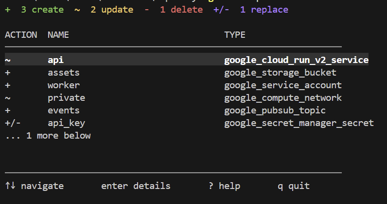
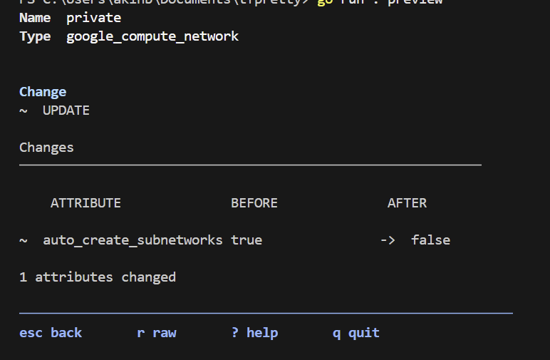
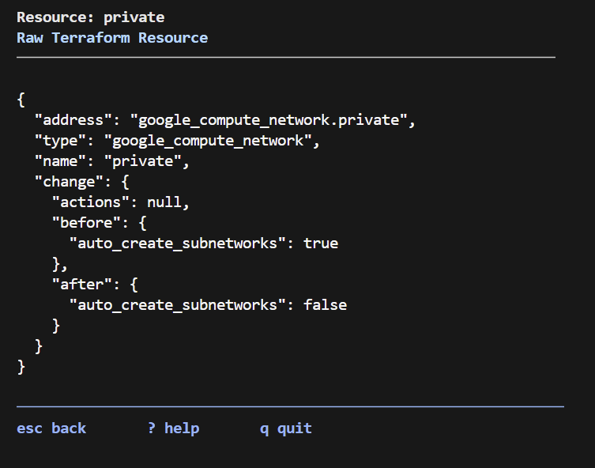

# tfpretty

A clearer, colorised way to read Terraform plans in your terminal.


<p>
	<a href="https://go.dev/"></a>
	<a href="https://developer.hashicorp.com/terraform"></a>
	<a href="LICENSE"></a>
	<a href="https://github.com/Akin-Genc0/tfpretty/actions"></a>
</p>



</div>

Terraform plans are useful, but the default output can be difficult to scan.
`tfpretty` runs the plan, parses its JSON output, and turns the result into a
focused interactive terminal UI.

## What it does

- Summarizes creates, updates, deletes, and replacements at a glance
- Lets you inspect a resource's changed attributes
- Shows the complete raw Terraform resource when you need more detail
- Uses color-coded actions and adapts to the terminal width
- Includes built-in help and keyboard navigation

## Requirements

- [Terraform](https://developer.hashicorp.com/terraform/install) on your `PATH`
- [Go](https://go.dev/dl/) 1.27+ if installing from source

## Install

Install the latest version with Go:

```powershell
go install github.com/Akin-Genc0/tfpretty@latest
```

Go installs the binary into `$(go env GOPATH)\bin`, usually
`%USERPROFILE%\go\bin`. Add that directory to your `PATH` if `tfpretty` is not
recognized by your terminal.

### Build from source

```powershell
git clone https://github.com/Akin-Genc0/tfpretty.git
cd tfpretty
go build -o tfpretty.exe .
```

## Usage

From an initialized Terraform workspace:

```powershell
terraform init
tfpretty plan
```

`tfpretty plan` runs `terraform plan`, creates a temporary plan file, reads it
with `terraform show -json`, and opens the interactive viewer.



## Controls

| Key | Action |
| --- | --- |
| `↑` / `↓` | Move between resources |
| `enter` | Open resource details |
| `r` | View the raw Terraform resource |
| `?` | Open help |
| `esc` | Return to the plan |
| `q` | Quit |



## Development

Run the tests:

```powershell
go test ./...
```

Preview the interface with sample data:

```powershell
go run . preview
```

Issues and pull requests are welcome.
